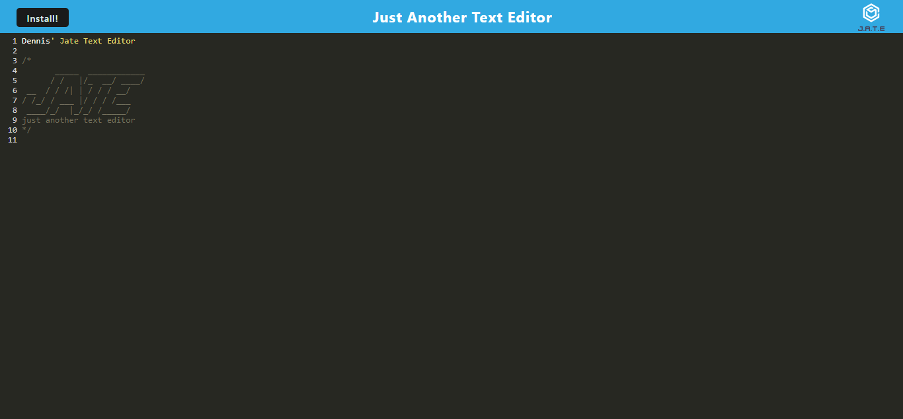

# JATE - Just another text editor

## Table of Contents
- [Description](#description)
- [Installation](#installation)
- [Usage](#usage)
- [Application](#application)
- [images](#images)
- [Tests](#tests)
- [questions](#questions)
- [Contributing](#contributing)
- [License](#license)
- [Copyright](#copyright)

## Description
- JATE is a web based text editor that can be installed as a progressive web application. It saves data using IndexedDB and is deployed to Heroku.

## Installation
Follow these steps to install this project on your local machine.
- Open Bash editor
- mkdir NoteTaker
- cd NoteTaker
- git clone https://github.com/Dlittlefield81/TextEditor.git
- npm i

## Usage
- After cloning this repository...
- Production mode: npm start
- Developer mode: npm run start:dev

## Application
- Link to Deployed Application: https://mighty-retreat-28358.herokuapp.com/

## Images
- -

## Tests
- node run test

## Questions
- Username: Dlittlefield81
- GitHub: https://github.com/Dlittlefield81/
- Email: Littlefield.Dennis@outlook.com

## Contributing
- If you would like to contribute...
- Email Me

## License
   This project is licenses under the General Public License v3.0 license.

## Copyright
- © Copyright 2022 Dennis Littlefield
    